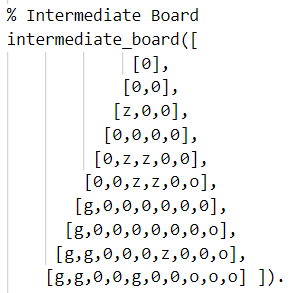
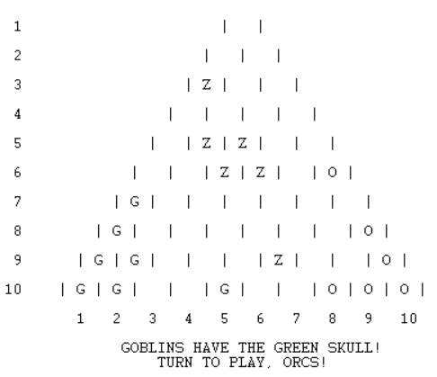
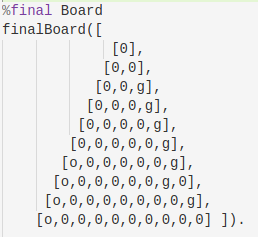
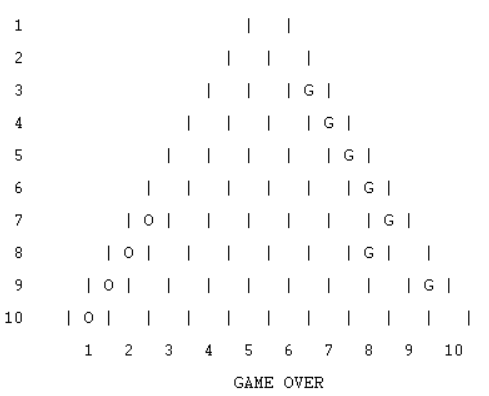

# GreenSkull

## Identificação:
* **Grupo**: Green Skull 4
* **Turma prática**: 6
* **Elementos**: Catarina Fernandes (up201806610), Jessica Nascimento (up201806723)

## Descrição do jogo:

- 2 jogadores  
- Inicialmente os Goblins (g) têm a Green Skull  
- Orcs (o) jogam primeiro.  

**Objetivo**  
Fazer chegar as peças ao outro lado do tabuleiro, saltando por cima do máximo de inimigos possível e manipulando os zombies para atrapalhar o adversário.

**Como jogar**  
Na vez de cada jogador, as suas peças podem fazer uma das seguintes ações:
- Mover-se para um espaço vazio adjacente
- Fazer uma série de saltos seguidos por cima de peças individuais, cada um para um espaço vazio (como nas damas), removendo a peça debaixo do salto, seja de quem for. Caso o jogador tenha a Green Skull deve entregá-la ao adversário.

Caso o jogador ainda tenha a Green Skull, deve escolher se quer que um zombie faça uma das opções de cima (incluindo entregar a Green Skull ao adversário caso o zombie salte).

**Fim do jogo**   
O jogo acaba quando:
- todas as peças em jogo de qualquer cor (zombies também) estão a tocar na borda da sua cor 

ou  
- quando todas as peças de uma cor foram capturadas

**Pontuação**
- 2 pontos para cada peça do jogador a tocar na borda da sua cor
- 1 ponto para cada peça capturada (por qualquer pessoa) que não pertença ao jogador 

Os zombies pontuam da mesma maneira. A espécie que tiver mais pontos ganha, mesmo que sejam os zombies!

**Bibliografia**
* [Página oficial do jogo](https://nestorgames.com/#greenskull_detail)
* [Livro de regras](https://nestorgames.com/rulebooks/GREENSKULL_EN.pdf)

## Representação interna do estado do jogo:
<!--indicação de como representam o estado do jogo, incluindo tabuleiro (tipicamente usando uma lista de listas com diferentes átomos para as peças), jogador atual, e eventualmente peças capturadas ou ainda por jogar, ou outras informações que possam ser necessárias (dependendo do jogo). Deve incluir exemplos da representação, em Prolog, de estados de jogo inicial, intermédio e final (que deverão estar também no ficheiro de código-ver abaixo), e indicação do significado de cada átomo (ex., como representam as diferentes peças)-->
A representação de cada especie é feita da seguinte maneira:
* Globins com a letra G;
* Orcs com a letra O;
* Zombies com a letra Z.

**Estado inicial do jogo:** 
 
 

**Estado intermédio do jogo:** 
 

**Estado final do jogo:** 
(Vítoria dos Globins) 
 

## Visualização do estado de jogo:
<!-- pequena descrição da implementação do predicado de visualização do estado de jogo (até 200 palavras)-->
