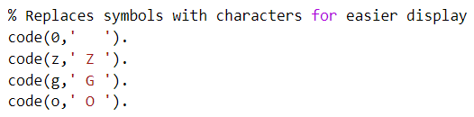
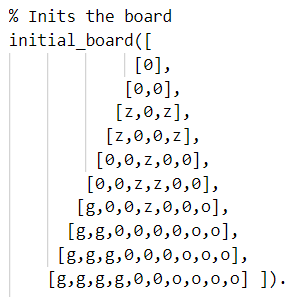
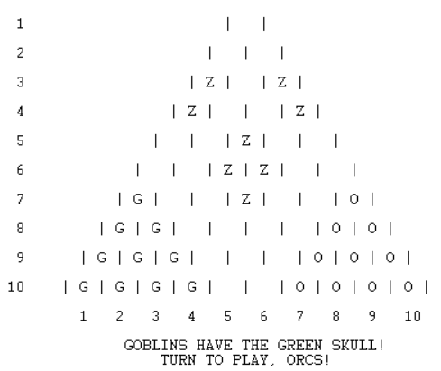

# **GreenSkull**

## **Identificação:**
* **Grupo**: Green Skull 4
* **Turma prática**: 6
* **Elementos**: 
    - Catarina Justo dos Santos Fernandes (up201806610)
    - Jéssica Mireie Fernandes Nascimento (up201806723)

## **Instalação e Execução:**
 Para iniciar o jogo, será necessário iniciar o sicstus e fazer consult('game.pl').
 Após consultar o ficheiro, basta colocar na linha de comandos o seguinte predicado: play.
 Após fazer o play, irá aparecer um menu onde poderá escolher entre ver instruções ou jogar, ao escolher jogar, poderá escolher o modo de jogo.

## **Descrição do jogo:**
- Jogo composto por 2 jogadores: um a representar os Orcs e o outro, os Goblins.
- As peças **o** representam os Orcs.
- As peças **g** representam os Goblins.
- As peças **z** representam os Zombies, que serão jogadas pelo o jogador com a Green Skull.
- Inicialmente o jogador com os Goblins é que tem a Green Skull na sua posse.
- Consoante as jogadas, a posse da Green Skull porderá ser mudada.
- O jogador com os Orcs jogam primeiro.  

**Objetivo**  
Fazer chegar as peças ao outro lado do tabuleiro, saltando por cima do máximo de inimigos possível e manipulando os zombies para atrapalhar o adversário.

**Como jogar**  
Na vez de cada jogador, as suas peças podem fazer uma das seguintes ações:
- Mover-se para um espaço vazio adjacente
- Fazer uma série de saltos seguidos por cima de peças individuais, cada um para um espaço vazio (como nas damas), removendo a peça debaixo do salto, seja de quem for. Caso o jogador tenha a Green Skull deve entregá-la ao adversário.

Caso o jogador ainda tenha a Green Skull, deve escolher se quer que um zombie faça uma das opções de cima (incluindo entregar a Green Skull ao adversário caso o zombie salte).

**Fim do jogo**   
O jogo acaba quando:
- todas as peças em jogo de qualquer cor (zombies também) estão a tocar na borda da sua cor 

ou  
- todas as peças de uma cor forem capturadas.

**Pontuação**
- 2 pontos para cada peça do jogador a tocar na borda da sua cor
- 1 ponto para cada peça capturada (por qualquer pessoa) que não pertença ao jogador 

Os zombies pontuam da mesma maneira. A espécie que tiver mais pontos ganha, mesmo que sejam os zombies!

**Bibliografia**
* [Página oficial do jogo](https://nestorgames.com/#greenskull_detail)
* [Livro de regras](https://nestorgames.com/rulebooks/GREENSKULL_EN.pdf)

## **Representação interna do estado do jogo:**
Escolhemos representar o estado do jogo através de um predicado composto por 3 elementos, GameState (que representa o estado atual do tabuleiro), Player (que reprenta o jogador que pode jogar naquela ronda) e GreenSkull (que representa o jogador que, naquele momento, tem a Green Skull em sua posse).  

**GameState** é uma lista de listas com diferentes átomos para as peças, codificadas para representar as diferentes espécies.  

  
A representação de cada especie é feita da seguinte maneira:
* Globins com a letra G;
* Orcs com a letra O;
* Zombies com a letra Z.

**Player** e **GreenSkull** são representados por um átomo que pode ser **g** ou **o**.  

## **Visualização do estado de jogo:**
O predicado de visualização do estado do jogo é **display_game** e recebe dois argumentos, um argumento composto **GameState-GreenSkull** e um argumento **Player**.  
O predicado começa por chamar o predicado **print_board**, que escreve na consola o tabuleiro, linha a linha (predicado **print_row**) com a respetiva numeração da linha e formatação (predicado **space**).  
Depois imprime a númeração das colunas (predicado **display_column_numbers**) e de quem é a vez de jogar, juntamente com quem tem a Green Skull (predicados **display_green_skull** e **display_player_turn** respetivamente).

# TO DO atualizar imagens.
**Estado inicial do jogo:**  
 
 

## **Lista de Jogadas Válidas:**
Para a obtenção das jogadas  válidas usamos o predicado **valid_moves**, que retorna 2 listas: uma para jogadas para casas adjacentes e outra para as jogadas que envolvem comer peças adversárias. Para as jogadas para casas adjacentes usamos o predicado **get_adjacent_move** que verifica as casas adjacentes disponiveis em todas as direções. Para as jogadas onde come as peças adversárias, **get_move_eat** verifica para todas as direções se é possivel comer uma ou mais peças adversárias.mo

## **Execução de Jogadas:**
A execução das jogadas é feita atravé do predicado **move**. Aqui vemos todas as jogadas válidas que o jogador pode fazer com com a peça escolhida e verificamos se a jogada pretendida está contida nessa lista. Caso esteja, então mudamos o estado do tabuleiro (predicado **change_board**) assim como as pontuações de cada espécie (**change_score**).
 
## **Final do Jogo:** 
Na passagem à próxima jogada através do predicado **next**, verificamos se chegamos ao fim do jogo através do predicado **game_over**,que só retornará ao next caso não tenhamos chegado ao fim. Para a verificação usamos o **is_over**, que percorre o GameState a fim de encontrar uma situação de final de jogo. Caso seja encontrado, prosseguirá para **final_scores**, que retorna as pontuação final do jogo, consoante o ultimo estado e seguidamente irá para o **get_winner** que retorna o vencedor consoante a pontuação final.

## **Avaliação do Tabuleiro:**
Forma(s) de avaliação do estado do jogo. O predicado deve chamar-se ​value(+GameState, +Player, -Value)​.

## **Jogada do Computador:**
Escolha da jogada a efetuar pelo computador, dependendo do nível de dificuldade. O predicado deve chamar-se choose_move(+GameState, +Player, +Level, -Move).

## **Conclusões:**
Conclusões do trabalho, incluindo limitações do trabalho desenvolvido ​knownissues​), assim como possíveis melhorias identificadas (​roadmap​).
(até 250 palavras)

## **Bibliografia:**
    Listagem de livros, artigos,páginas Web e outros recursos usados durante o desenvolvimento do trabalho
