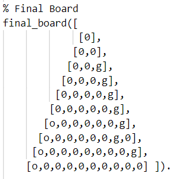

# GreenSkull

## Identificação:
* **Grupo**: Green Skull 4
* **Turma prática**: 6
* **Elementos**: 
    - Catarina Justo dos Santos Fernandes (up201806610)
    - Jéssica Mireie Fernandes Nascimento (up201806723)

## Descrição do jogo:

- 2 jogadores  
- Inicialmente os Goblins (g) têm a Green Skull  
- Orcs (o) jogam primeiro.  

**Objetivo**  
Fazer chegar as peças ao outro lado do tabuleiro, saltando por cima do máximo de inimigos possível e manipulando os zombies para atrapalhar o adversário.

**Como jogar**  
Na vez de cada jogador, as suas peças podem fazer uma das seguintes ações:
- Mover-se para um espaço vazio adjacente
- Fazer uma série de saltos seguidos por cima de peças individuais, cada um para um espaço vazio (como nas damas), removendo a peça debaixo do salto, seja de quem for. Caso o jogador tenha a Green Skull deve entregá-la ao adversário.

Caso o jogador ainda tenha a Green Skull, deve escolher se quer que um zombie faça uma das opções de cima (incluindo entregar a Green Skull ao adversário caso o zombie salte).

**Fim do jogo**   
O jogo acaba quando:
- todas as peças em jogo de qualquer cor (zombies também) estão a tocar na borda da sua cor 

ou  
- quando todas as peças de uma cor foram capturadas

**Pontuação**
- 2 pontos para cada peça do jogador a tocar na borda da sua cor
- 1 ponto para cada peça capturada (por qualquer pessoa) que não pertença ao jogador 

Os zombies pontuam da mesma maneira. A espécie que tiver mais pontos ganha, mesmo que sejam os zombies!

**Bibliografia**
* [Página oficial do jogo](https://nestorgames.com/#greenskull_detail)
* [Livro de regras](https://nestorgames.com/rulebooks/GREENSKULL_EN.pdf)

## Representação interna do estado do jogo:
Escolhemos representar o estado do jogo através de um predicado composto por 3 elementos, GameState (que representa o estado atual do tabuleiro), Player (que reprenta o jogador que pode jogar naquela ronda) e GreenSkull (que representa o jogador que, naquele momento, tem a Green Skull em sua posse).  

**GameState** é uma lista de listas com diferentes átomos para as peças, codificadas para representar as diferentes espécies.  

  
A representação de cada especie é feita da seguinte maneira:
* Globins com a letra G;
* Orcs com a letra O;
* Zombies com a letra Z.

**Player** e **GreenSkull** são representados por um átomo que pode ser **g** ou **o**.  

## Visualização do estado de jogo:
O predicado de visualização do estado do jogo é **display_game** e recebe dois argumentos, um argumento composto **GameState-GreenSkull** e um argumento **Player**.  
O predicado começa por chamar o predicado **print_board**, que escreve na consola o tabuleiro, linha a linha (predicado **print_row**) com a respetiva numeração da linha e formatação (predicado **space**).  
Depois imprime a númeração das colunas (predicado **display_column_numbers**) e de quem é a vez de jogar, juntamente com quem tem a Green Skull (predicados **display_green_skull** e **display_player_turn** respetivamente).

### **Estado inicial do jogo:**  

 
 

### **Estado intermédio do jogo:**  

 
  

### **Estado final do jogo:**  

(Vítoria dos Globins)  
 

